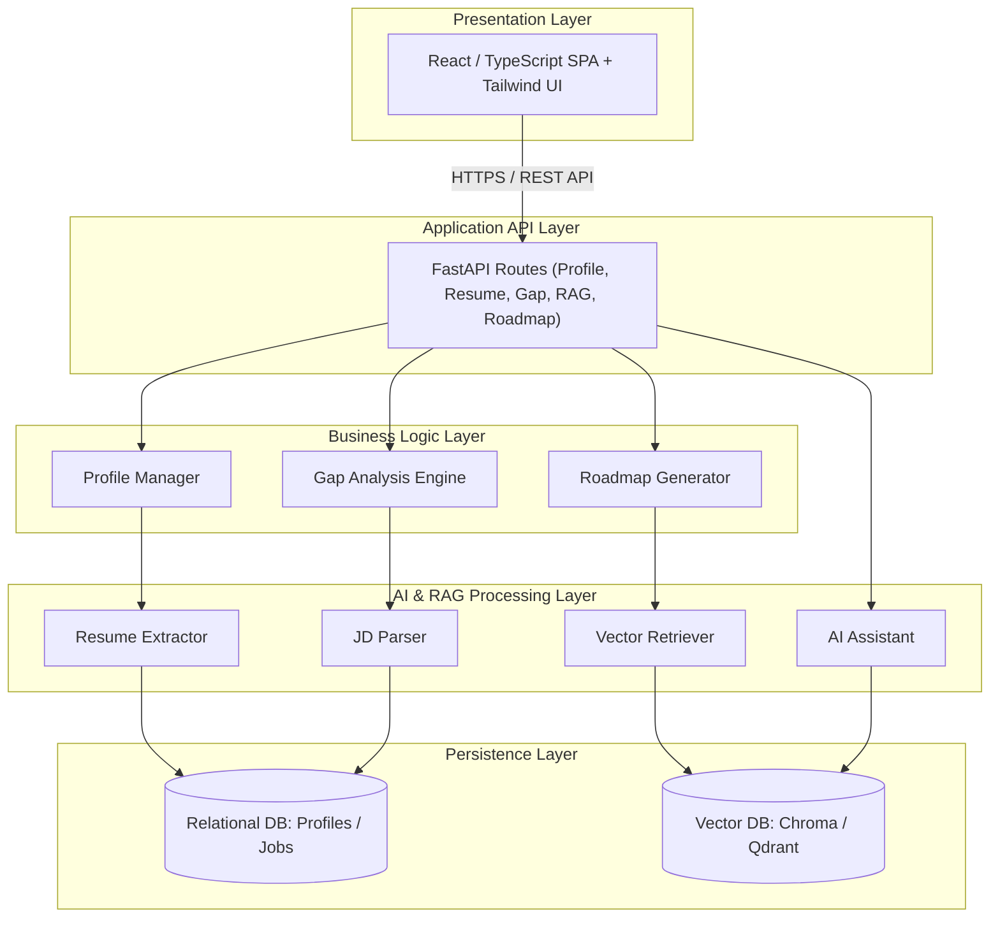
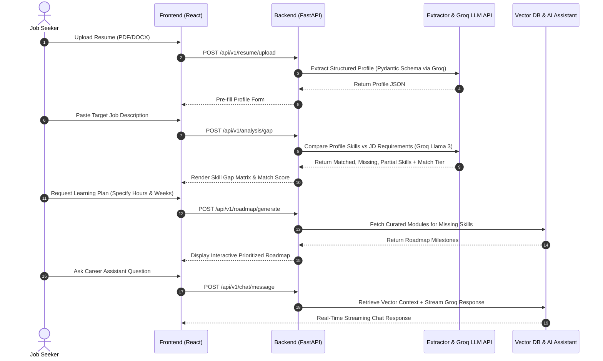
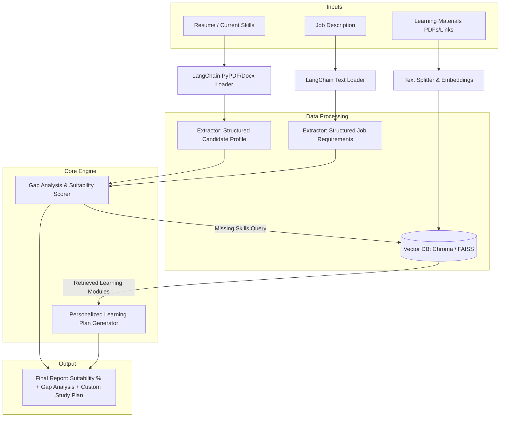

# Career Compass AI

_AI-Powered Career Navigation, Skill Gap Analysis & Upskilling Platform_

<div align="center">


</div>

---

## 1. Project Title

**Career Compass AI** — _Intelligent Career Copilot for Resume Parsing, Skill Gap Analysis, Personalized Learning Roadmaps, and Contextual Career Guidance._

---

## 2. Project Overview

**Career Compass AI** is an end-to-end, data-driven career development platform designed to bridge the gap between job seekers' existing skill sets and rapidly evolving industry demands.

By integrating Natural Language Processing (NLP), structured Pydantic extraction, and Retrieval-Augmented Generation (RAG), Career Compass AI allows users to upload resumes, analyze target job descriptions, discover granular skill gaps, receive prioritized learning plans, and interact with a streaming AI Career Assistant.

---

## 3. Problem Statement

1. **Skill Mismatch & Industry Evolution**: Tech requirements evolve faster than educational curricula, leaving candidates with uncalibrated skill gaps.
2. **Generic Career Advice**: Traditional counseling lacks precise, data-driven evaluation of a candidate's actual qualifications against specific job descriptions.
3. **Black-Box ATS Filtering**: Applicants frequently suffer rejection without understanding why their resume failed Automated Tracking System (ATS) screens.
4. **Information Overload**: An overwhelming abundance of online courses makes it difficult to prioritize high-impact learning paths.

---

## 4. Key Features

- 📄 **Resume Parser & Extractor**: Parses `.pdf` and `.docx` files to extract technical/soft skills, work history, projects, certifications (with links), and web profiles (GitHub, LinkedIn, Portfolio).
- 🎯 **Job Description Parser**: Extracts structured criteria from pasted text (Title, Required vs. Preferred Skills, Experience, Education, Responsibilities, Work Mode, Location, and Salary).
- 📊 **3-Way Skill Gap Analysis**: Categorizes skills into **Matched**, **Missing**, and **Partially Available** skills.
- 🏆 **Career Match Assessment**: Evaluates candidacy into **High Match**, **Moderate Match**, or **Low Match** tiers, accompanied by Strengths, Skill Gaps, Weaknesses, and Strategic Improvements.
- 🚀 **Skill Prioritization**: Ranks missing skills into actionable badges (`Priority 1 — Core Blocking`, `Priority 2 — High Value`, `Priority 3 — Secondary`).
- 🗺️ **Personalized Learning Plan**: Generates milestone-based roadmaps tailored to user-specified weekly learning hours and preferred study duration.
- 💬 **RAG-Powered AI Career Assistant**: Contextual streaming chatbot providing interactive guidance on resume tailoring, interview prep, and skill acquisition.

---

## 5. System Architecture

Career Compass AI uses a **Layered Monolith Architecture** engineered for high modularity and microservice readiness.



---

## 6. Tech Stack

### Shieldcn Badges Matrix

#### **Frontend**


#### **Backend**


#### **AI & Data Persistence**


#### **DevOps & Quality Assurance**


| Layer                   | Technologies Used                                                                                 |
| :---------------------- | :------------------------------------------------------------------------------------------------ |
| **Frontend**            | React 18, TypeScript, Vite, Tailwind CSS, Lucide Icons                                            |
| **Backend**             | Python 3.11+, FastAPI, Pydantic v2, Uvicorn, SQLAlchemy                                           |
| **AI & RAG**            | LangChain (`langchain-groq`), **Groq LPU Inference API** (Llama 3.3 70B), Gemini/OpenAI, ChromaDB |
| **Testing**             | Pytest, HTTPX                                                                                     |
| **DevOps & Containers** | Docker, Docker Compose                                                                            |

---

## 7. Project Structure

```
career-compass-ai/
├── backend/
│   ├── app/
│   │   ├── api/             # REST Route Controllers (profile, resume, gap, chat)
│   │   ├── core/            # Configuration, Security, Environment settings
│   │   ├── db/              # Database initialization & session management
│   │   ├── models/          # Pydantic Schemas & SQLAlchemy ORM Models
│   │   ├── services/
│   │   │   ├── extractors/  # Resume & Job Description LLM Parsers (Groq / Gemini)
│   │   │   ├── gap_analysis/# Skill Matching & Readiness Heuristics
│   │   │   └── rag/         # Vector Store Retriever & Streaming Chat Chains
│   │   └── utils/           # Text Sanitization & File Helpers
│   ├── pyproject.toml
│   └── requirements.txt
├── frontend/
│   ├── src/
│   │   ├── components/      # ResumeUploader, SkillGapMatrix, RoadmapView, ChatWidget
│   │   ├── pages/           # Dashboard, Analysis, Settings
│   │   ├── services/        # API Axios Client & Interceptors
│   │   └── App.tsx
│   ├── package.json
│   └── vite.config.ts
├── docs/                    # PRD.md, SRS.md, SAD.md, IMPLEMENTATION_PLAN.md
├── tests/                   # Pytest Unit & Integration Suite
├── docker-compose.yml
└── README.md
```

---

## 8. How It Works



---

## 9. Setup & Installation

### Prerequisites

- **Python**: 3.11 or higher
- **Node.js**: 18.0 or higher
- **Groq API Key**: Obtain a free API key from [Groq Console](https://console.groq.com/keys)
- **Docker** _(Optional)_: Desktop v20+

### Backend Setup

1. Navigate to the backend directory:
   ```bash
   cd backend
   ```
2. Create and activate a Python virtual environment:
   ```bash
   python -m venv .venv
   # Windows
   .venv\Scripts\activate
   # macOS/Linux
   source .venv/bin/activate
   ```
3. Install dependencies (includes `langchain-groq`):
   ```bash
   pip install -r requirements.txt
   ```

### Frontend Setup

1. Navigate to the frontend directory:
   ```bash
   cd ../frontend
   ```
2. Install dependencies:
   ```bash
   npm install
   ```

---

## 10. Environment Variables

Create a `.env` file in the `backend/` directory:

```env
# Server Settings
ENVIRONMENT=development
PORT=8000
CORS_ORIGINS=["http://localhost:3000","http://localhost:5173"]

# LLM Provider Configuration (Groq LPU Inference)
LLM_PROVIDER=groq
GROQ_API_KEY=gsk_your_groq_api_key_from_console_groq_com
GROQ_MODEL=llama-3.3-70b-versatile

# Fallback LLM Providers
GEMINI_API_KEY=your_google_gemini_api_key_here
OPENAI_API_KEY=your_openai_api_key_here

# Vector Store & Persistence
VECTOR_DB_DIR=./data/vector_store
DATABASE_URL=sqlite:///./data/career_compass.db
```

---

## 11. Running the Application

### Option A: Local Development Mode

1. **Start the Backend API Server**:

   ```bash
   cd backend
   uvicorn app.main:app --reload --port 8000
   ```

   _Backend API docs available at: `http://localhost:8000/docs`_

2. **Start the Frontend Development Server**:
   ```bash
   cd frontend
   npm run dev
   ```
   _Frontend application available at: `http://localhost:5173`_

### Option B: Docker Compose

Start the full stack with containerized services:

```bash
docker-compose up --build
```

---

## 12. API Documentation

| Endpoint                   | Method                 | Description                                                 |
| :------------------------- | :--------------------- | :---------------------------------------------------------- |
| `/api/v1/profile`          | `GET` / `POST` / `PUT` | Manage user profile attributes                              |
| `/api/v1/resume/upload`    | `POST`                 | Upload and parse `.pdf`/`.docx` resume file                 |
| `/api/v1/jobs/extract`     | `POST`                 | Parse raw pasted Job Description text                       |
| `/api/v1/analysis/gap`     | `POST`                 | Perform 3-way skill gap & career readiness match assessment |
| `/api/v1/roadmap/generate` | `POST`                 | Generate milestone-based learning plan                      |
| `/api/v1/chat/message`     | `POST`                 | Send question to streaming RAG AI Career Assistant          |

---

## 13. AI / LangChain Architecture

The core data processing pipeline leverages LangChain and Pydantic structured output models:



---

## 14. Testing

Run the backend automated test suite using `pytest`:

```bash
cd backend
pytest tests/ -v
```

---

## 15. Evaluation & Performance Metrics

- **Matching Precision**: $> 85\%$ accuracy in extracting skills and categorizing gaps.
- **API Response Latency**: $< 10\text{ s}$ for full resume parsing and gap analysis workflows.
- **Streaming Chat Latency**: $< 2\text{ s}$ first-token delivery for the AI Career Assistant.

---

## 16. Screenshots / Demo

- **Resume Uploader & Profile Extractor UI**: Drag-and-drop resume parser with instant entity pre-filling.
- **Skill Gap Matrix**: 3-column comparative view (Matched vs. Missing vs. Partial Skills).
- **Personalized Roadmap**: Prioritized skill milestones ($P1, P2, P3$) with interactive task checkboxes.
- **Streaming AI Assistant**: Conversational chat interface answering targeted career prep questions.

---

## 17. Limitations

- **Image-Only Resumes**: Scanned image PDFs without text layers require OCR pre-processing.
- **Third-Party API Rate Limits**: High-frequency LLM extraction calls depend on external provider quotas.
- **Manual Job Input**: MVP relies on pasted Job Description text (automated web scraping planned for future release).

---

## 18. Future Improvements

- 🔄 **LinkedIn Data Import**: One-click profile sync via OAuth integration.
- 🤖 **Multi-Agent Orchestration**: LangGraph multi-agent teams for deep career coaching.
- 🌐 **Live Job Board Indexing**: Direct integration with job APIs to auto-fetch live job descriptions.
- 🎙️ **Mock Interview Simulator**: Real-time AI voice/video interview practice.
