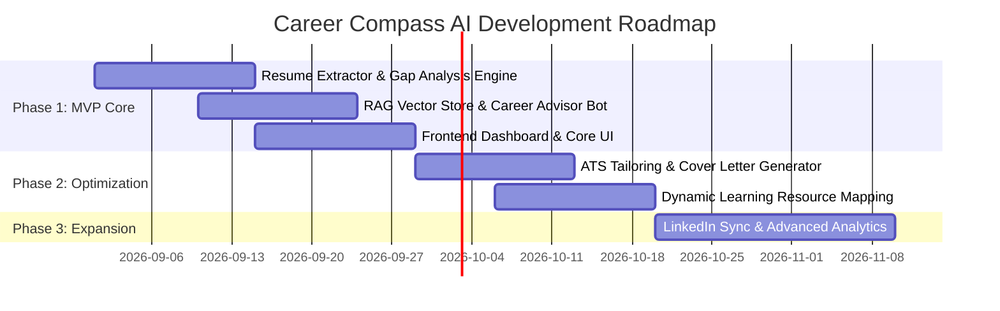

# Product Requirement Document (PRD)

## Project Title

**Career Compass AI** — _AI-Powered Career Navigation, Skill Gap Analysis & Upskilling Platform_

---

## 1. Executive Summary

**Career Compass AI** is an intelligent, AI-driven career development platform designed to bridge the gap between job seekers' current capabilities and evolving industry requirements. By leveraging Natural Language Processing (NLP), Retrieval-Augmented Generation (RAG), and machine learning, Career Compass AI extracts profile data from resumes, performs detailed skill gap analyses against real-time job market demands, generates personalized learning roadmaps, and provides tailored career advising.

---

## 2. Target Users & Personas

### 2.1 Primary User Personas

| Persona                             | Description                                                                                                         | Key Pain Points                                                                               | Goals & Needs                                                                                   |
| :---------------------------------- | :------------------------------------------------------------------------------------------------------------------ | :-------------------------------------------------------------------------------------------- | :---------------------------------------------------------------------------------------------- |
| **Early-Career / Recent Graduates** | Students or recent graduates entering the tech/professional job market.                                             | Lack of clarity on industry expectations; unoptimized resumes; overwhelming learning choices. | Step-by-step roadmap to acquire relevant skills; resume alignment for entry-level roles.        |
| **Career Switchers**                | Professionals pivoting from non-tech or adjacent fields into new specialized roles (e.g., Data Science, AI, Cloud). | Difficulty identifying transferable skills; unknown knowledge gaps; generic career advice.    | Clear mapping of transferable skills; targeted upskilling recommendations; realistic timeline.  |
| **Mid-Career Professionals**        | Experienced professionals seeking promotion, role transition, or salary growth.                                     | Stagnant skill sets; uncalibrated market value; lack of structured career planning.           | Industry benchmark comparison; targeted advanced skill recommendations; interview preparedness. |

### 2.2 Secondary User Personas

- **Recruiters & Talent Developers**: Seek standardized insights into candidate skill gaps for internal mobility or candidate upskilling.
- **Mentors & Educators**: Require structured data on student/mentee skill progressions to provide targeted guidance.

---

## 3. Problem Statement & Proposed Solution

### 3.1 Problem Statement

1. **Skill Mismatch & Rapid Market Evolution**: Technology and job requirements evolve faster than traditional education curricula, leaving job seekers with outdated or missing skills.
2. **Unstructured & Generic Career Guidance**: Traditional career counseling lacks granular, data-driven insights tailored to an individual’s specific skill profile and target role.
3. **Black-Box ATS Filtering**: Job applicants struggle to understand why their resumes fail Automated Tracking Systems (ATS) screening.
4. **Information Overload**: Abundance of online courses and resources makes it difficult for learners to choose high-impact learning paths.

### 3.2 Proposed Solution

Career Compass AI offers an end-to-end, data-driven career copilot:

- **Automated Resume & Profile Extraction**: Converts unstructured resumes (PDF/DOCX) into structured skill graphs.
- **Automated Skill Gap Analysis**: Compares candidate skill vectors against target job descriptions to calculate compatibility percentages and missing core/secondary skills.
- **RAG-Driven Career Advisor**: Uses Retrieval-Augmented Generation over live industry skill databases and market trend documents to provide contextual advice.
- **Dynamic Learning & Actionable Roadmaps**: Generates custom, milestone-based learning plans curated with actionable resources.
- **Resume & ATS Optimizer**: Provides targeted recommendations to tailor resumes and cover letters for specific job roles.

---

## 4. Key Product Features

### 4.1 Module 1: Profile Management & Resume Extractor

- **Multi-Format Parsing**: Support for PDF, DOCX, and text resume uploads.
- **Information Extraction**:
  - Technical Skills & Soft Skills
  - Work Experience & Project History
  - Educational Background & Certifications
- **Skill Taxonomies**: Mapping extracted terms to standard skill taxonomies (e.g., Python, PyTorch, RAG, System Design).

### 4.2 Module 2: Target Role & Skill Gap Analysis

- **Role Benchmarking**: Input a target job title or paste a Job Description (JD).
- **Match Score Calculation**: Algorithmic scoring (%) based on required vs. possessed skills.
- **Categorized Gap Breakdown**:
  - **Critical Gaps** (Must-have skills missing)
  - **Secondary Gaps** (Nice-to-have skills missing)
  - **Strengths & Transferable Skills** (Existing overlapping competencies)

### 4.3 Module 3: RAG-Powered AI Career Advisor

- **Contextual Career Chatbot**: RAG architecture built with vector search over curated career knowledge bases.
- **Market Insights & Benchmarking**: Real-time Q&A on salary expectations, role expectations, and emerging industry trends.
- **Interactive Guidance**: Explaining _why_ specific skills are needed for a target role.

### 4.4 Module 4: Personalized Learning & Upskilling Roadmap

- **Milestone Generation**: Phased learning path (e.g., Month 1: Fundamentals, Month 2: Core Frameworks, Month 3: Projects).
- **Resource Curation**: Curated links to documentation, open-source projects, and top learning platforms.
- **Progress Tracking**: Interactive task checklists to mark completed learning milestones.

### 4.5 Module 5: ATS & Resume Tailoring

- **ATS Compatibility Scoring**: Feedback on resume structure, formatting, and keyword density.
- **Smart Bullet Point Generator**: AI-suggested accomplishment bullet points utilizing impact metrics.
- **Custom Cover Letter Drafting**: Auto-generated cover letters tailored to specific JDs and user experience.

---

## 5. Scope & Feature Prioritization (MoSCoW Framework)

### 5.1 In-Scope vs. Out-of-Scope

#### **In-Scope (Core Platform)**

- Resume parsing and structured profile creation.
- Skill gap analysis against user-provided job descriptions.
- RAG-based AI conversational advisor.
- Milestone-based roadmap generation.
- Web-based frontend UI for interactive user experience.

#### **Out-of-Scope (Initial Release)**

- Direct job portal application automation (auto-applying to job boards).
- Live video interview simulation (WebRTC audio/video AI interviewer).
- Paid subscription/billing engine integrations.

---

### 5.2 MoSCoW Feature Categorization

```
+-----------------------------------------------------------------------+
|                              MUST HAVE                                |
|  - Resume Upload & Parsing Engine (PDF/DOCX)                          |
|  - Automated Skill Gap Analysis Engine                                |
|  - Match Score Calculator (%)                                         |
|  - RAG-based AI Career Chat Assistant                                 |
|  - Basic Personalized Roadmap Generator                               |
|  - User Dashboard (Skill Profile & Progress Visualizer)               |
+-----------------------------------------------------------------------+
|                             SHOULD HAVE                               |
|  - Job Description URL Scraping / Automated JD Ingestion               |
|  - ATS Resume Keyword Optimization Recommendations                     |
|  - Tailored Cover Letter Generator                                    |
|  - Course / Resource Curation Integrations                            |
+-----------------------------------------------------------------------+
|                             COULD HAVE                                |
|  - LinkedIn Profile Import / Sync                                     |
|  - Peer & Mentor Review Request Feature                               |
|  - Market Salary Range Calculator                                     |
|  - Interactive Skill Assessment Quizzes                               |
+-----------------------------------------------------------------------+
|                             WON'T HAVE (Phase 1)                      |
|  - Native Mobile App (iOS / Android)                                  |
|  - Full HR / Enterprise Recruiter ATS Integration                     |
|  - Automated Web Job Application Submission                           |
+-----------------------------------------------------------------------+
```

---

## 6. Phased Implementation Roadmap



### Phase 1: MVP Core (Weeks 1–4)

- Implement backend parsing service (`backend/app/services/extractors`).
- Implement gap analysis algorithm (`backend/app/services/gap_analysis`).
- Setup vector store & RAG pipeline (`backend/app/services/rag`).
- Build basic React frontend dashboard for resume upload, gap visualization, and chat interface.

### Phase 2: Resume Optimization & Course Integration (Weeks 5–8)

- Add ATS keyword scoring & cover letter generator.
- Integrate curated course mapping for identified missing skills.
- Enhance RAG knowledge base with up-to-date industry domain docs.

### Phase 3: Platform Expansion (Weeks 9+)

- Add user account authentication & saved history.
- Implement LinkedIn data import capabilities.
- Community sharing & mentor feedback hooks.

---

## 7. Success Metrics & KPIs

- **User Engagement**: Average session length with RAG Advisor & roadmap completion rate (>60%).
- **Match Accuracy**: User satisfaction rating on extracted skills and identified skill gaps (>85% precision).
- **Career Impact**: Percentage of users who report improved ATS resume match scores or successful interviews post-upskilling.
