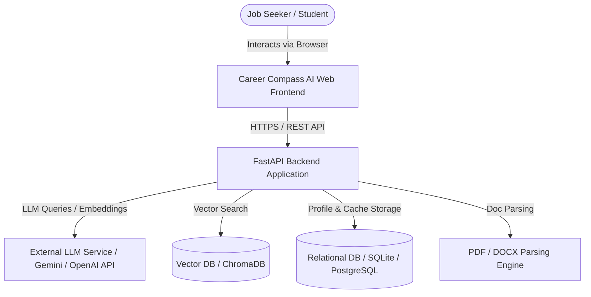
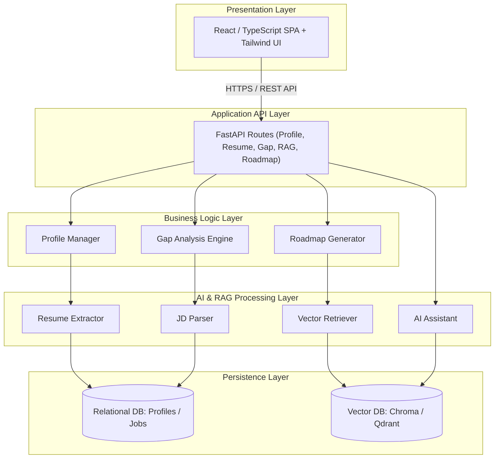
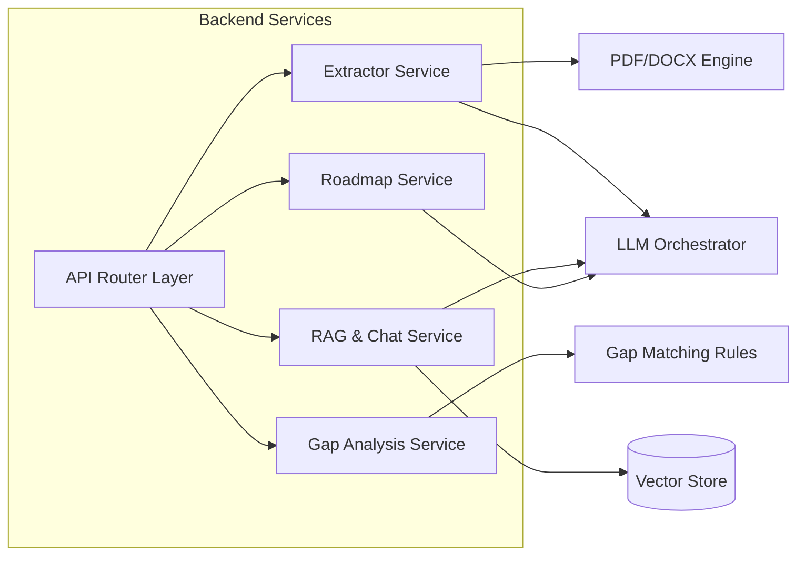
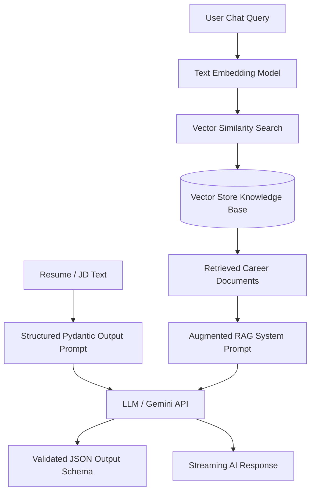
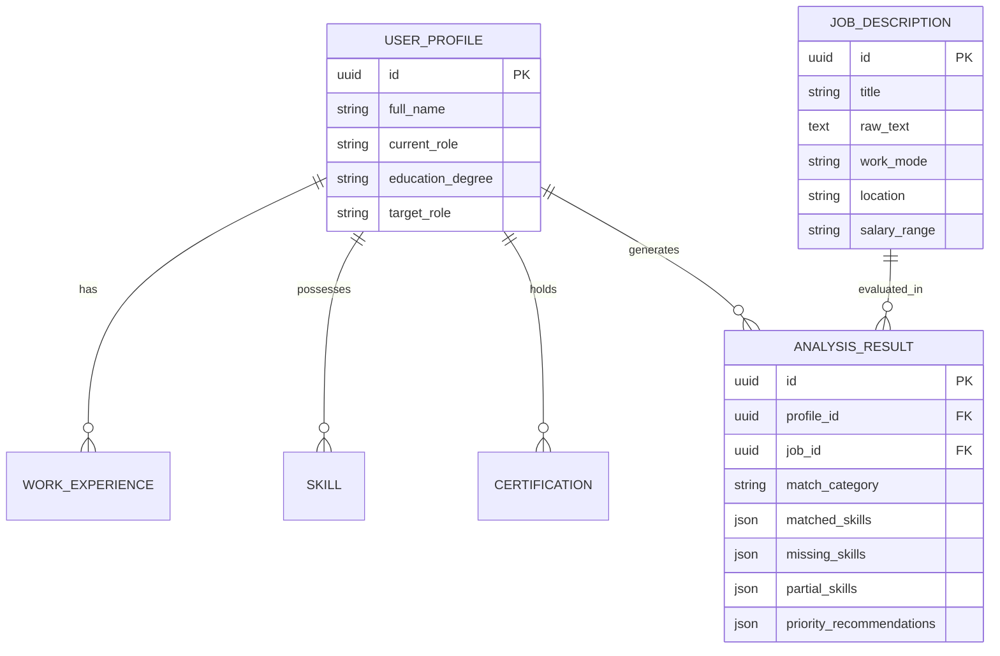
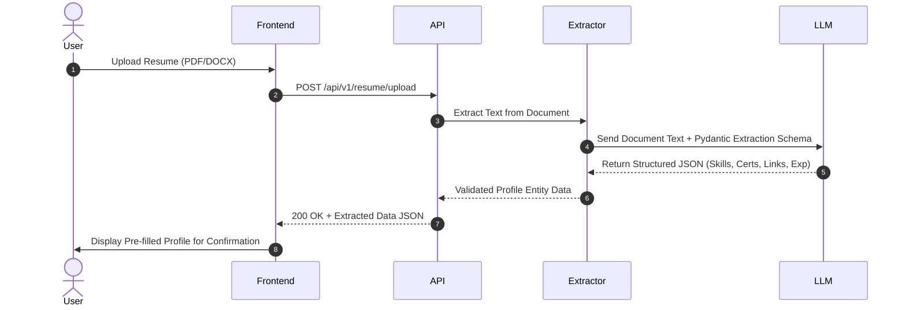
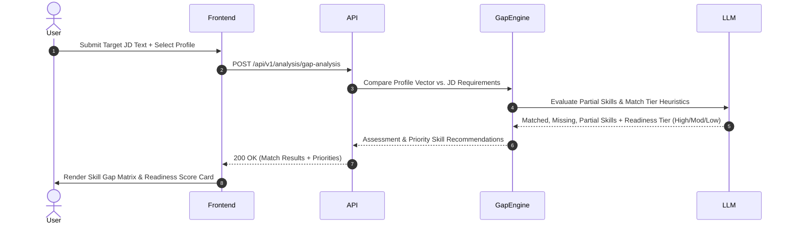
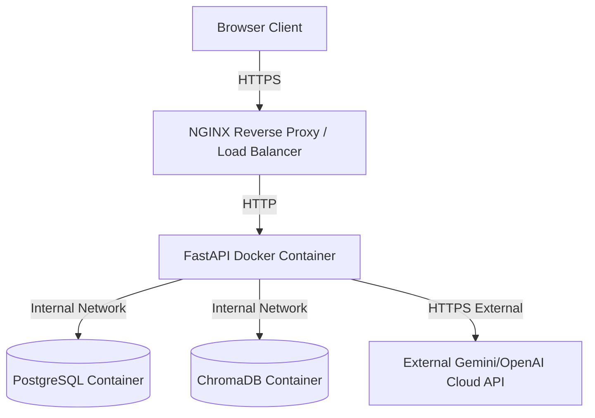

# System Architecture Document (SAD)

## Project Title

**Career Compass AI** — _AI-Powered Career Navigation, Skill Gap Analysis & Upskilling Platform_

---

## 1. Document Overview

This document provides a comprehensive description of the software architecture for **Career Compass AI**. It details the system structure, architectural patterns, component interactions, data flows, and technological choices.

This architecture directly realizes the product capabilities outlined in the **Product Requirement Document (`PRD.md`)** and satisfies all functional (FR-01 to FR-10) and non-functional (NFR-01 to NFR-06) requirements specified in the **Software Requirements Specification (`SRS.md`)**.

---

## 2. Architectural Goals and Principles

1. **Modularity & Decoupling**: Strict isolation between Web API logic, business rules, AI extraction pipelines, and data persistence layers.
2. **AI Provider Agnosticism**: Abstracted LLM interfaces to allow seamless switching or load-balancing between model providers (e.g., Google Gemini, OpenAI, Anthropic) without altering business logic.
3. **Data Security & PII Protection**: Strict boundaries ensuring personal user data in uploaded resumes is securely processed, encrypted, and isolated from public index leaks.
4. **Resilience & Fallback Readiness**: Robust error handling for unstructured inputs, parser failures, and external LLM rate limits.
5. **High Responsiveness**: Asynchronous processing and streaming response capabilities to keep UI latency low during heavy LLM workflows.

---

## 3. System Context

The System Context diagram illustrates how users and external services interact with Career Compass AI.



### Actors & External Interfaces

- **Job Seeker / Student**: End-user managing profile, uploading resumes, analyzing target job descriptions, viewing learning roadmaps, and interacting with the Career AI Assistant.
- **LLM Service Provider**: External API providing generative and extraction capabilities.
- **Vector Store**: Dedicated database storing embedded career documents, skill taxonomies, and domain knowledge for RAG retrieval.

## 4. High-Level Architecture

Career Compass AI adopts a **Layered Monolith Architecture** engineered to be microservice-ready.



---

## 5. Architecture Style and Patterns

- **Layered Architecture**: Clear separation across Presentation, API, Domain Logic, AI Workflows, and Persistence.
- **Retrieval-Augmented Generation (RAG)**: Combines user profile context with embedded industry career knowledge to produce grounded LLM advice.
- **Pipeline Pattern (Extract-Transform-Analyze)**: Sequential pipeline processing for Resume Parsing -> Entity Extraction -> Vector Matching -> Skill Gap Calculation -> Roadmap Generation.
- **Repository & Service Pattern**: Encapsulates data access and AI orchestration logic behind standardized Python service interfaces.

---

## 6. Component Architecture



---

## 7. Frontend Architecture

- **Framework**: React 18+ with TypeScript and Vite.
- **State Management**: React Context / Zustand for lightweight global user state (Profile, active JD, match results).
- **HTTP Client**: Axios / Fetch with interceptors for error handling and request cancellation.
- **Key Components**:
  - `ResumeUploader`: Supports drag-and-drop file upload with progress indicator.
  - `ProfileViewer`: Editable profile UI pre-filled by extracted resume entities.
  - `JobDescriptionInput`: Text area with character counter and formatting controls.
  - `SkillGapMatrix`: Side-by-side visual matrix for Matched, Missing, and Partial skills.
  - `MatchScoreCard`: Readiness assessment widget (High / Moderate / Low).
  - `LearningRoadmapView`: Timeline widget rendering prioritized skill milestones.
  - `CareerChatWidget`: Streaming conversational interface for the AI assistant.

---

## 8. Backend Architecture

- **Framework**: FastAPI (Python 3.11+), leveraging native `asyncio` for non-blocking I/O.
- **Directory Structure Mapping**:
  - `backend/app/api`: Endpoint controllers (`profile.py`, `resume.py`, `analysis.py`, `chat.py`).
  - `backend/app/core`: Configuration, environment variables, security utilities.
  - `backend/app/models`: Pydantic schemas & SQLAlchemy ORM models.
  - `backend/app/services`:
    - `extractors/`: Resume and JD parser implementations.
    - `gap_analysis/`: Skill matching algorithms and readiness scoring logic.
    - `rag/`: Vector retriever, knowledge base indexers, and LLM chat chains.

---

## 9. AI & LangChain Architecture



- **Framework**: LangChain / LlamaIndex abstractions for managing prompts, chains, and document retrieval.
- **Structured Parsing**: Enforces strict JSON schemas using Pydantic models to guarantee zero-hallucination structural outputs for skills, experience, and metadata.
- **Vector Store**: ChromaDB / Qdrant instance storing embedded career documents, industry skill taxonomies, and interview preparation guides.

---

## 10. Data Architecture

### 10.1 Relational Schema (Key Entities)



### 10.2 Vector Database Collection Schema

- **Collection Name**: `career_knowledge_base`
- **Metadata Fields**: `source_doc`, `category` (Skill Taxonomy, Salary Benchmark, Interview Prep), `skill_tag`.
- **Embedding Model**: `text-embedding-004` / `text-embedding-3-small`.

---

## 11. External Services and Integrations

- **LLM Provider API**: Google Gemini API / OpenAI API for core reasoning, parsing, and chat.
- **Document Parser**: `pypdf` / `pdfplumber` for PDF text extraction; `python-docx` for Word document processing.
- **Vector Database**: Local ChromaDB instance (MVP) with seamless cloud migration path (Qdrant Cloud / Pinecone).

---

## 12. Key System Workflows

### 12.1 Resume Extraction & Profile Auto-Fill



### 12.2 Skill Gap & Career Match Assessment Workflow



---

## 13. API Architecture

All endpoints follow RESTful conventions under `/api/v1/`:

| Endpoint                   | Method         | Description                         | Request Payload       | Response Payload            |
| :------------------------- | :------------- | :---------------------------------- | :-------------------- | :-------------------------- |
| `/api/v1/profile`          | `POST` / `PUT` | Create or update user profile       | `UserProfileSchema`   | `UserProfileResponse`       |
| `/api/v1/resume/upload`    | `POST`         | Upload & parse resume document      | `multipart/form-data` | `ExtractedResumeSchema`     |
| `/api/v1/jobs/extract`     | `POST`         | Parse raw Job Description text      | `JobDescriptionInput` | `ExtractedJobSchema`        |
| `/api/v1/analysis/gap`     | `POST`         | Perform Skill Gap Analysis          | `GapAnalysisRequest`  | `GapAnalysisResponse`       |
| `/api/v1/roadmap/generate` | `POST`         | Generate Personalized Learning Plan | `RoadmapRequest`      | `RoadmapResponse`           |
| `/api/v1/chat/message`     | `POST`         | Send message to AI Career Assistant | `ChatMessageInput`    | `Streaming / JSON Response` |

---

## 14. Security Architecture

- **PII Redaction & Isolation**: Uploaded resume files are processed in ephemeral memory buffers and deleted post-parsing unless explicit user storage is enabled.
- **Transport & Rest Security**: TLS 1.3 encryption for all data in transit; AES-256 for persistent database storage.
- **Input Sanitization**: Strict HTML/script tag stripping on all JD text inputs and profile fields to prevent XSS and prompt injection attacks.
- **API Key Protection**: Server-side API key injection for LLMs; zero client-side exposure of AI credentials.

---

## 15. Error Handling and Resilience

- **Parser Fallbacks**: If standard PDF parsing yields unreadable text (e.g., scanned images), the system returns a clear error requesting OCR or text-based documents.
- **LLM Circuit Breaker & Retries**: Uses exponential backoff (via `tenacity`) for transient 429/500 API errors.
- **Structured Output Validation**: Pydantic schema validation errors trigger automated single-retry repair prompts to the LLM.
- **Partial Failures**: If salary or location cannot be extracted from a job description, default placeholders ("Not Specified") are assigned without failing the overall request.

---

## 16. Deployment Architecture



- **Containerization**: Fully dockerized environment using multi-stage `Dockerfile` builds for frontend and backend.
- **Orchestration**: `docker-compose` setup for local development and simplified production deployment.

---

## 17. Scalability and Performance

- **Asynchronous Execution**: Native FastAPI `async/await` prevents worker blocking during remote LLM API calls.
- **Response Caching**: In-memory LRU / Redis caching for repeated JD skill extractions and static skill taxonomy lookups.
- **Vector Index Indexing**: HNSW (Hierarchical Navigable Small World) indexing in ChromaDB for sub-50ms vector retrieval.

---

## 18. Technology Decisions

| Technology Component   | Selection                 | Rationale                                                                                     |
| :--------------------- | :------------------------ | :-------------------------------------------------------------------------------------------- |
| **Frontend Framework** | React + TypeScript + Vite | High performance, strict typing for complex profile state, fast developer feedback loop.      |
| **Backend Framework**  | FastAPI (Python 3.11+)    | Async native, automatic OpenAPI documentation, seamless integration with Python AI libraries. |
| **AI Orchestration**   | LangChain / Native SDKs   | Standardized prompt templates, streaming support, and vendor-agnostic LLM abstractions.       |
| **Vector DB**          | ChromaDB (MVP)            | Lightweight, zero-config embedding store easily portable to Qdrant/Pinecone in production.    |
| **Validation Layer**   | Pydantic v2               | High-speed data validation and seamless LLM structured output enforcement.                    |

---

## 19. Architecture Decision Records (ADRs)

### ADR-01: Adoption of Layered Monolith over Microservices

- **Context**: Need rapid development iteration with minimal operational complexity.
- **Decision**: Adopt a modular layered monolith layout where domain services (`extractors`, `gap_analysis`, `rag`) are strictly decoupled internally.
- **Consequences**: Enables simple deployment while leaving clean interfaces to split microservices in future if load demands.

### ADR-02: Structured LLM Output via Pydantic Schemas

- **Context**: Raw LLM output string responses cause parsing errors when building downstream gap analysis matrices.
- **Decision**: Enforce JSON mode and Pydantic schema enforcement on all extraction LLM calls.
- **Consequences**: Guarantees deterministic backend responses and eliminates runtime `KeyError` crashes.

---

## 20. Future Architecture Evolution

```
[Phase 1: Current Baseline] ---> [Phase 2: Advanced Optimizations] ---> [Phase 3: Ecosystem Scale]
- Single-node FastAPI           - Background Task Queue (Celery/Redis) - Multi-Agent Workflow Engine
- Local ChromaDB Vector Store    - Distributed Vector DB (Qdrant)       - Automated Job Web Scraping
- Direct LLM REST Calls          - Redis Cache Layer                    - Real-time Interview Simulation
```

- **Phase 2**: Introduce Redis caching and Celery background workers for heavy resume processing.
- **Phase 3**: Transition to Multi-Agent Orchestration (e.g., CrewAI / LangGraph) for multi-step career planning and live job board scraping.
