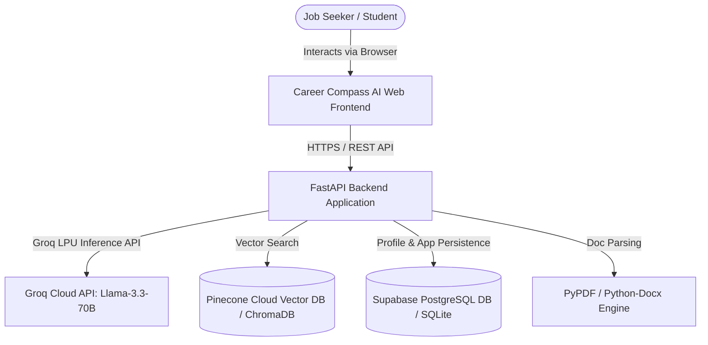
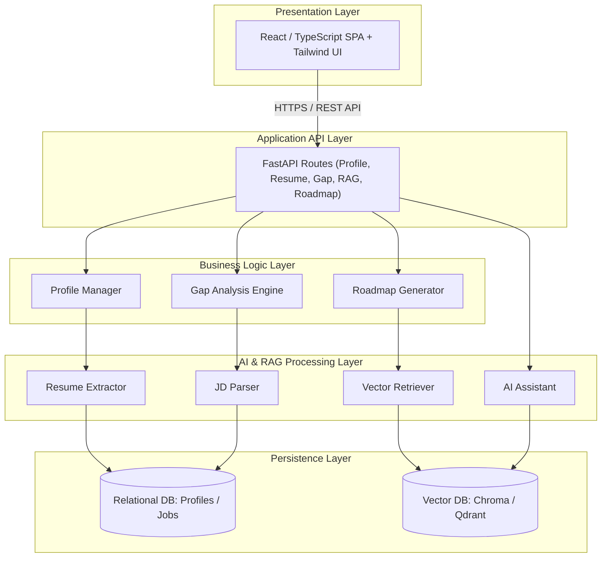
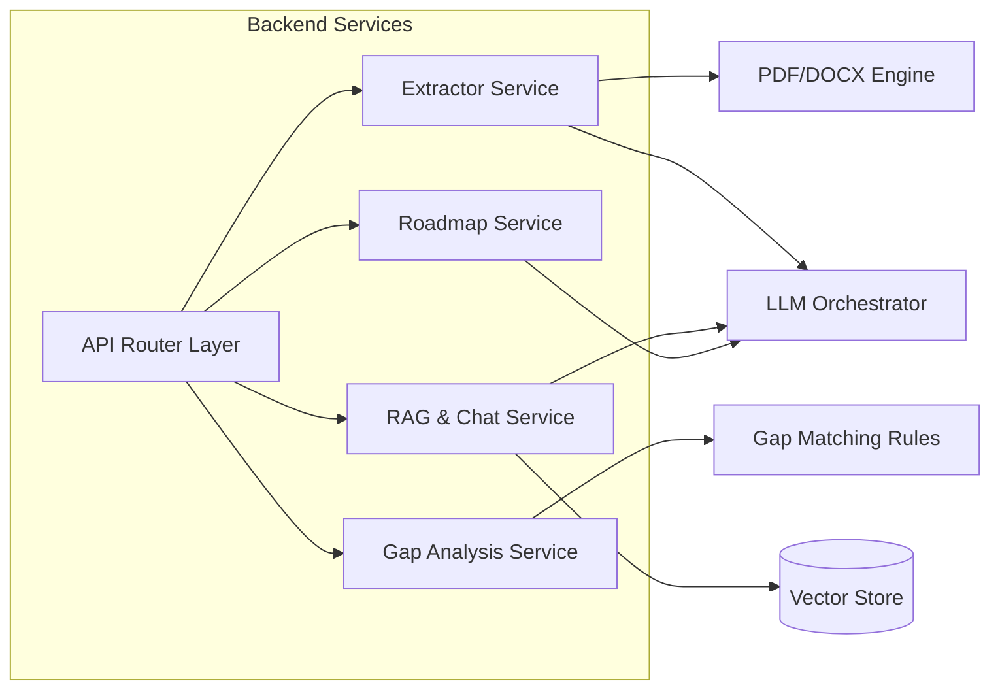
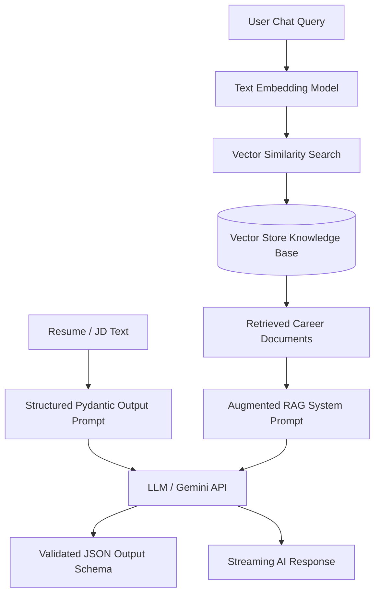
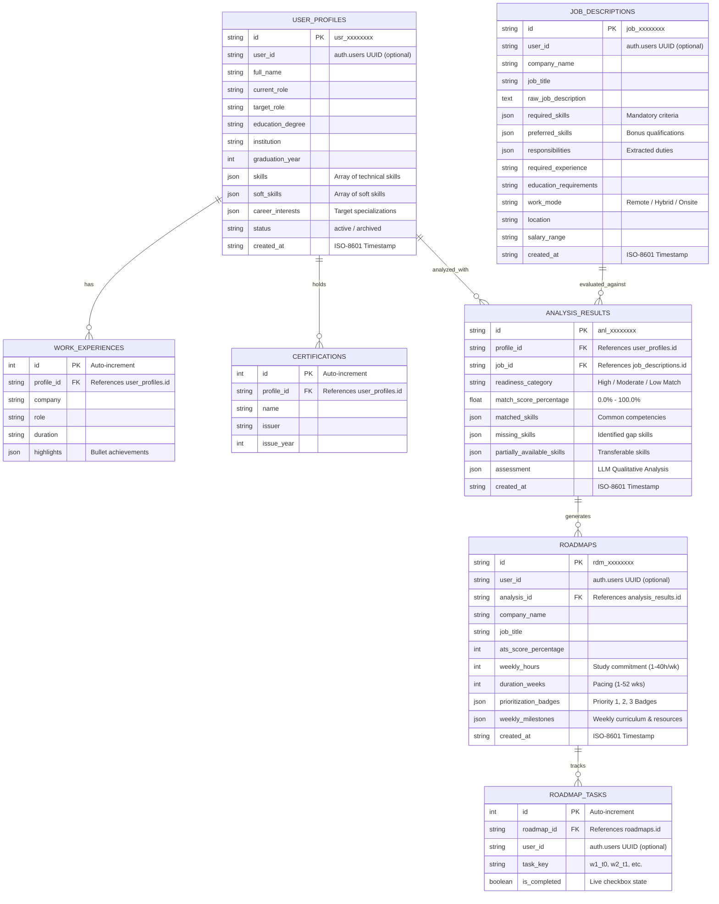
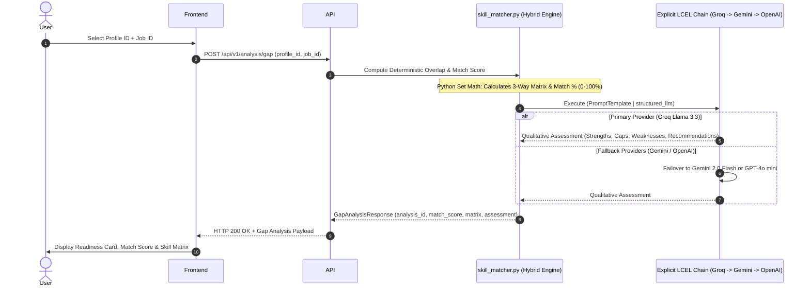
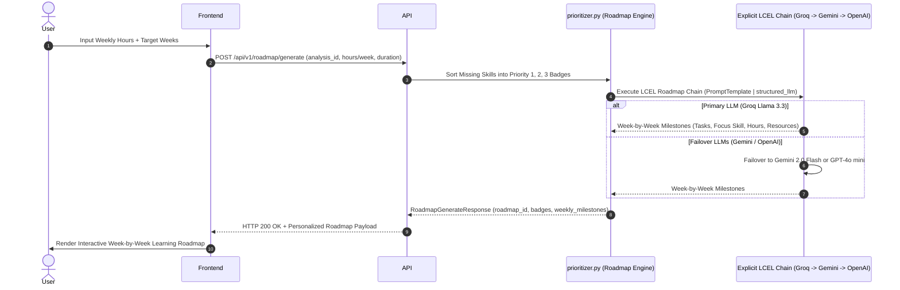
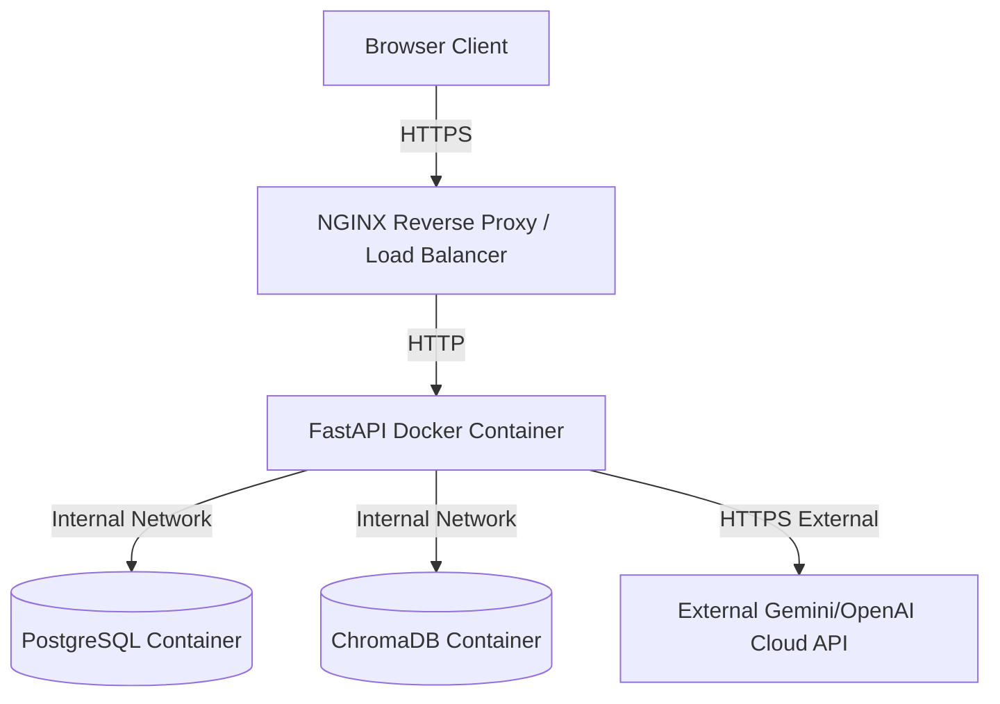

# System Architecture Document (SAD)

## Project Title

**Career Compass AI** — _AI-Powered Career Navigation, Skill Gap Analysis & Upskilling Platform_

---

## 1. Document Overview

This document provides a comprehensive description of the software architecture for **Career Compass AI**. It details the system structure, architectural patterns, component interactions, data flows, and technological choices.

This architecture directly realizes the product capabilities outlined in the **Product Requirement Document (`PRD.md`)** and satisfies all functional (FR-01 to FR-10) and non-functional (NFR-01 to NFR-06) requirements specified in the **Software Requirements Specification (`SRS.md`)**.

---

## 2. Architectural Goals and Principles

1. **Modularity & Decoupling**: Strict isolation between Web API logic, business rules, AI extraction pipelines, and data persistence layers.
2. **AI Provider Agnosticism**: Abstracted LLM interfaces to allow seamless switching or load-balancing between model providers (e.g., Google Gemini, OpenAI, Anthropic) without altering business logic.
3. **Data Security & PII Protection**: Strict boundaries ensuring personal user data in uploaded resumes is securely processed, encrypted, and isolated from public index leaks.
4. **Resilience & Fallback Readiness**: Robust error handling for unstructured inputs, parser failures, and external LLM rate limits.
5. **High Responsiveness**: Asynchronous processing and streaming response capabilities to keep UI latency low during heavy LLM workflows.

---

## 3. System Context

The System Context diagram illustrates how users and external services interact with Career Compass AI.



### Actors & External Interfaces

- **Job Seeker / Student**: End-user managing profile, uploading resumes, analyzing target job descriptions, viewing learning roadmaps, and interacting with the Career AI Assistant.
- **LLM Service Provider**: External API providing generative and extraction capabilities.
- **Vector Store**: Dedicated database storing embedded career documents, skill taxonomies, and domain knowledge for RAG retrieval.

## 4. High-Level Architecture

Career Compass AI adopts a **Layered Monolith Architecture** engineered to be microservice-ready.



---

## 5. Architecture Style and Patterns

- **Layered Architecture**: Clear separation across Presentation, API, Domain Logic, AI Workflows, and Persistence.
- **Retrieval-Augmented Generation (RAG)**: Combines user profile context with embedded industry career knowledge to produce grounded LLM advice.
- **Pipeline Pattern (Extract-Transform-Analyze)**: Sequential pipeline processing for Resume Parsing -> Entity Extraction -> Vector Matching -> Skill Gap Calculation -> Roadmap Generation.
- **Repository & Service Pattern**: Encapsulates data access and AI orchestration logic behind standardized Python service interfaces.

---

## 6. Component Architecture



---

## 7. Frontend Architecture

- **Framework**: React 18+ with TypeScript and Vite.
- **State Management**: React Context / Zustand for lightweight global user state (Profile, active JD, match results).
- **HTTP Client**: Axios / Fetch with interceptors for error handling and request cancellation.
- **Key Components**:
  - `ResumeUploader`: Supports drag-and-drop file upload with progress indicator.
  - `ProfileViewer`: Editable profile UI pre-filled by extracted resume entities.
  - `JobDescriptionInput`: Text area with character counter and formatting controls.
  - `SkillGapMatrix`: Side-by-side visual matrix for Matched, Missing, and Partial skills.
  - `MatchScoreCard`: Readiness assessment widget (High / Moderate / Low).
  - `LearningRoadmapView`: Timeline widget rendering prioritized skill milestones.
  - `CareerChatWidget`: Streaming conversational interface for the AI assistant.

---

## 8. Backend Architecture

- **Framework**: FastAPI (Python 3.11+), leveraging native `asyncio` for non-blocking I/O.
- **Directory Structure Mapping**:
  - `backend/app/api`: Endpoint controllers (`profile.py`, `resume.py`, `analysis.py`, `chat.py`).
  - `backend/app/core`: Configuration, environment variables, security utilities.
  - `backend/app/models`: Pydantic schemas & SQLAlchemy ORM models.
  - `backend/app/services`:
    - `extractors/`: Resume and JD parser implementations.
    - `gap_analysis/`: Skill matching algorithms and readiness scoring logic.
    - `rag/`: Vector retriever, knowledge base indexers, and LLM chat chains.

---

## 9. AI & LangChain Architecture



- **Framework**: LangChain / LlamaIndex abstractions for managing prompts, chains, and document retrieval.
- **Structured Parsing**: Enforces strict JSON schemas using Pydantic models to guarantee zero-hallucination structural outputs for skills, experience, and metadata.
- **Vector Store**: ChromaDB / Qdrant instance storing embedded career documents, industry skill taxonomies, and interview preparation guides.

---

## 10. Data Architecture

### 10.1 Two-Tier Storage Architecture

Career Compass AI implements a **Two-Tier Storage Strategy**:

1. **Tier 1 (Client-Side Guest Mode)**: Zero-friction offline persistence via browser `localStorage` (`career_compass_saved_roadmaps`, `career_compass_active_roadmap_id`). Enables immediate interactive exploration without authentication barriers.
2. **Tier 2 (Cloud Production Tier)**: Persistent multi-tenant synchronization powered by **Supabase Auth & PostgreSQL**. Secures personal career data with Row-Level Security (RLS) policies (`auth.uid() = user_id`) across devices.

### 10.2 Relational Schema (1:N Multi-Job & Roadmap Tracking)

A candidate frequently applies to multiple positions simultaneously ($1 : N$). Against a single parsed resume profile, multiple job descriptions, gap evaluations, learning roadmaps, and task completions are tracked concurrently.



### 10.3 Vector Database Collection Schema

- **Collection Name**: `career_knowledge_base`
- **Metadata Fields**: `source_doc`, `category` (Skill Taxonomy, Salary Benchmark, Interview Prep), `skill_tag`.
- **Embedding Model**: `text-embedding-004` / `text-embedding-3-small`.

---

## 11. External Services and Integrations

- **LLM Provider API**: **Groq Cloud LPU Inference API** (`llama-3.3-70b-versatile`) for ultra-low latency parsing, gap evaluation, and streaming chat.
- **LLM Provider APIs (Multi-Provider Fallback Chain)**:
  - **Primary**: **Groq Cloud LPU Inference API** (`llama-3.3-70b-versatile`) for ultra-low latency parsing, gap evaluation, and streaming chat.
  - **Fallback 1**: **Google Gemini API** (`gemini-2.0-flash`) triggered automatically if Groq encounters rate limits, timeouts, or downtime.
  - **Fallback 2**: **OpenAI API** (`gpt-4o-mini`) triggered if both Groq and Gemini are unavailable.
- **Relational Database**: **Supabase PostgreSQL** for cloud persistence of profiles, job criteria, and gap analysis results.
- **Vector Database**: **Pinecone Cloud Serverless** (`career-compass-index`, 384/768-dim, Cosine metric) for zero-maintenance RAG vector search (ChromaDB for local fallback).
- **Document Parsers**: `pypdf` for PDF text extraction; `python-docx` for Word document processing.

---

## 12. Key System Workflows

### 12.1 Resume Extraction & Profile Auto-Fill

```mermaid
sequenceDiagram
    autonumber
    actor User
    participant Frontend
    participant API
    participant Extractor
    participant LLM
    participant LLMChain as Multi-LLM Engine (Groq -> Gemini -> OpenAI)

    User->>Frontend: Upload Resume (PDF/DOCX)
    Frontend->>API: POST /api/v1/resume/upload
    API->>Extractor: Extract Text from Document
    Extractor->>LLM: Send Document Text + Pydantic Extraction Schema
    LLM-->>Extractor: Return Structured JSON (Skills, Certs, Links, Exp)
    API->>Extractor: Extract Text from Document Stream (RAM Only)
    Extractor->>LLMChain: Send Document Text + Pydantic Extraction Schema (Try Groq)
    alt Groq Success
        LLMChain-->>Extractor: Structured JSON (Skills, Certs, Links, Exp)
    else Groq Failure / Rate Limit
        LLMChain->>LLMChain: Fallback to Google Gemini (gemini-2.0-flash)
        alt Gemini Success
            LLMChain-->>Extractor: Structured JSON
        else Gemini Failure
            LLMChain->>LLMChain: Fallback to OpenAI (gpt-4o-mini)
    Extractor-->>API: Verified Resume JSON Payload
    API-->>Frontend: HTTP 200 OK + Extracted Resume Data
```

---

### 12.2 Skill Gap & Match Assessment Workflow (`POST /api/v1/analysis/gap`)



---

### 12.3 Personalized Learning Roadmap Workflow (`POST /api/v1/roadmap/generate`)



---

## 13. API Architecture

All endpoints follow RESTful conventions under `/api/v1/`:

| Endpoint                   | Method         | Description                         | Request Payload       | Response Payload            |
| :------------------------- | :------------- | :---------------------------------- | :-------------------- | :-------------------------- |
| `/api/v1/profile`          | `POST` / `PUT` | Create or update user profile       | `UserProfileSchema`   | `UserProfileResponse`       |
| `/api/v1/resume/upload`    | `POST`         | Upload & parse resume document      | `multipart/form-data` | `ExtractedResumeSchema`     |
| `/api/v1/jobs/extract`     | `POST`         | Parse raw Job Description text      | `JobDescriptionInput` | `ExtractedJobSchema`        |
| `/api/v1/analysis/gap`     | `POST`         | Perform Skill Gap Analysis          | `GapAnalysisRequest`  | `GapAnalysisResponse`       |
| `/api/v1/roadmap/generate` | `POST`         | Generate Personalized Learning Plan | `RoadmapRequest`      | `RoadmapResponse`           |
| `/api/v1/chat/message`     | `POST`         | Send message to AI Career Assistant | `ChatMessageInput`    | `Streaming / JSON Response` |

---

## 14. Security Architecture

- **PII Redaction & Isolation**: Uploaded resume files are processed in ephemeral memory buffers and deleted post-parsing unless explicit user storage is enabled.
- **Transport & Rest Security**: TLS 1.3 encryption for all data in transit; AES-256 for persistent database storage.
- **Input Sanitization**: Strict HTML/script tag stripping on all JD text inputs and profile fields to prevent XSS and prompt injection attacks.
- **API Key Protection**: Server-side API key injection for LLMs; zero client-side exposure of AI credentials.

---

## 15. Error Handling and Resilience

- **Parser Fallbacks**: If standard PDF parsing yields unreadable text (e.g., scanned images), the system returns a clear error requesting OCR or text-based documents.
- **LLM Circuit Breaker & Retries**: Uses exponential backoff (via `tenacity`) for transient 429/500 API errors.
- **Structured Output Validation**: Pydantic schema validation errors trigger automated single-retry repair prompts to the LLM.
- **Partial Failures**: If salary or location cannot be extracted from a job description, default placeholders ("Not Specified") are assigned without failing the overall request.

---

## 16. Deployment Architecture



- **Containerization**: Fully dockerized environment using multi-stage `Dockerfile` builds for frontend and backend.
- **Orchestration**: `docker-compose` setup for local development and simplified production deployment.

---

## 17. Scalability and Performance

- **Asynchronous Execution**: Native FastAPI `async/await` prevents worker blocking during remote LLM API calls.
- **Response Caching**: In-memory LRU / Redis caching for repeated JD skill extractions and static skill taxonomy lookups.
- **Vector Index Indexing**: HNSW (Hierarchical Navigable Small World) indexing in ChromaDB for sub-50ms vector retrieval.

---

## 18. Technology Decisions

| Technology Component        | Selection                             | Rationale                                                                                                  |
| :-------------------------- | :------------------------------------ | :--------------------------------------------------------------------------------------------------------- |
| **Frontend Framework**      | React + TypeScript + Vite             | High performance, strict typing for complex profile state, fast developer feedback loop.                   |
| **Backend Framework**       | FastAPI (Python 3.11+)                | Async native, automatic OpenAPI documentation, seamless integration with Python AI libraries.              |
| **AI Orchestration**        | LangChain (`langchain-groq`)          | Vendor-agnostic prompt templates, structured output parsing, and native streaming support.                 |
| **LLM Inference Engine**    | **Groq Cloud LPU** (`llama-3.3-70b`)  | Ultra-fast token inference ($> 500\text{ tokens/sec}$), ultra-low latency for parsing and streaming.       |
| **Relational SQL Database** | **Supabase PostgreSQL**               | Cloud-native managed Postgres with 500MB free storage, connection pooling, and web dashboard.              |
| **Vector AI Database**      | **Pinecone Cloud Serverless**         | 2GB free serverless vector storage (`career-compass-index`, Cosine metric) for zero-disk RAG.              |
| **Dense Embedding Model**   | **`BAAI/bge-small-en-v1.5`**          | 384 dims, 512 max tokens capacity, #1 MTEB rank, CPU fast execution, normalized Cosine metric.             |
| **RAG Retrieval Strategy**  | **Parent-Child (Hierarchical 3A-K5)** | Child: 250 chars (~70 tok), Parent: 1500 chars (~420 tok), Top-K=5. 100% Hit Rate, 0.92 F1, 0.3ms latency. |
| **Validation Layer**        | Pydantic v2                           | High-speed data validation and seamless LLM structured output enforcement.                                 |

---

## 19. Architecture Decision Records (ADRs)

### ADR-01: Adoption of Layered Monolith over Microservices

- **Context**: Need rapid development iteration with minimal operational complexity.
- **Decision**: Adopt a modular layered monolith layout where domain services (`extractors`, `gap_analysis`, `rag`) are strictly decoupled internally.
- **Consequences**: Enables simple deployment while leaving clean interfaces to split microservices in future if load demands.

### ADR-02: Structured LLM Output via Pydantic Schemas

- **Context**: Raw LLM output string responses cause parsing errors when building downstream gap analysis matrices.
- **Decision**: Enforce JSON mode and Pydantic schema enforcement on all extraction LLM calls.
- **Consequences**: Guarantees deterministic backend responses and eliminates runtime `KeyError` crashes.

### ADR-03: Groq Cloud LPU API for Ultra-Fast LLM Inference

- **Context**: Resume parsing and RAG streaming chat required sub-second responsiveness to avoid user drop-off.
- **Decision**: Adopt Groq LPU inference engine (`langchain-groq`, `llama-3.3-70b-versatile`) as the primary LLM provider.
- **Consequences**: Delivers ultra-low latency ($< 1\text{ s}$ streaming start) while maintaining fallback routing to Gemini/OpenAI if rate limits occur.

### ADR-04: Supabase PostgreSQL for Relational Database Persistence

- **Context**: Need a robust, cloud-managed SQL database for user profiles, job criteria, and analysis results.
- **Decision**: Adopt Supabase PostgreSQL via SQLAlchemy ORM and `psycopg2-binary`, keeping SQLite for local offline development.
- **Consequences**: Provides high-performance SQL persistence with zero code changes between local and cloud environments.

### ADR-05: Pinecone Cloud Serverless for RAG Vector Storage

- **Context**: Hosting backend on serverless/cloud platforms requires vector storage without managing local server disks.
- **Decision**: Adopt Pinecone Cloud Serverless (`langchain-pinecone`, 384/768-dim, Cosine metric).
- **Consequences**: Offloads vector indexing and semantic RAG search to Pinecone's 2GB free serverless tier.

### ADR-06: Explicit LCEL Runnable Chains for AI Pipeline Composition

- **Context**: AI execution pipelines (Skill Gap Assessment, Roadmap Generation) require modular, reusable prompt-model composition with multi-provider failover.
- **Decision**: Adopt explicit LangChain Expression Language (LCEL) Runnable Chains (`ChatPromptTemplate | structured_llm`) across `skill_matcher.py` and `prioritizer.py`.
- **Consequences**: Ensures clean template variable injection, seamless multi-provider failover (Groq → Gemini → OpenAI), and async execution support (`ainvoke`).

### ADR-07: Selection of BAAI/bge-small-en-v1.5 for Dense Vector Embedding

- **Context**: RAG vectorization requires an open-source, CPU-efficient embedding model capable of processing 256–512 token chunks without truncation or edge self-attention degradation.
- **Decision**: Adopt `BAAI/bge-small-en-v1.5` (384 dimensions, 512 max token capacity) via `langchain_huggingface` as the unified system embedding model.
- **Justification**:
  1. **512 Token Capacity**: Double the 256-token limit of older models like `all-MiniLM-L6-v2`, allowing Medium and Large document chunks to be vectorized without tail truncation.
  2. **Optimal 384-Dim Vector Compactness**: Maintains fast CPU search latency ($< 20\text{ms}$) and minimal Pinecone Cloud memory usage.
  3. **#1 Benchmark Accuracy**: Ranked top of its size class on the HuggingFace MTEB Leaderboard with normalized Cosine Similarity optimization.
  4. **Zero API Cost**: Executes locally in Python without per-query embedding API charges.
- **Consequences**: Ensures complete consistency across offline evaluation benchmarks (`EXP-RAG-01`) and live candidate chat sessions.

### ADR-08: Parent-Child Hierarchical Chunking (3A-K5) for Knowledge Base Retrieval

- **Context**: RAG retrieval requires high factual accuracy, complete context without mid-sentence truncations, and sub-millisecond retrieval latency across diverse technical, interview, and behavioral documents.
- **Decision**: Adopt Configuration `3A-K5` (Parent-Child / Hierarchical Chunking with Top-$K=5$):
  - **Child Chunk Size**: 250 characters (~70 tokens), 35 char overlap (for pinpoint vector similarity matching).
  - **Parent Chunk Size**: 1500 characters (~420 tokens), 150 char overlap (injected into prompt for complete semantic context).
  - **Top-K**: $K=5$ candidates retrieved.
- **Justification (Empirically Verified in EXP-RAG-01)**:
  1. **100.0% Hit Rate**: Successfully retrieved target knowledge across all 10 Golden Benchmark Queries.
  2. **0.95 MRR@5**: High reciprocal rank; in 90% of test queries, the correct chunk was the #1 ranked result.
  3. **0.92 F1-Score (Precision: 0.90, Recall: 0.96)**: Cleanest factual extraction with minimal prompt token pollution.
  4. **0.3ms Retrieval Latency**: Blazingly fast normalized dot-product search on CPU.
  5. **93.68 / 100 Composite Winner Score**: Decisive winner out of 10 evaluated matrix configurations.
- **Consequences**: Adopted in `backend/app/services/rag/ingest.py` and `retriever.py`. Ensures high-precision vector matches while downstream LLMs receive full paragraph and code snippet context without loss.

---

## 20. Future Architecture Evolution

```
[Phase 1: Current Baseline] ---> [Phase 2: Advanced Optimizations] ---> [Phase 3: Ecosystem Scale]
- Single-node FastAPI           - Background Task Queue (Celery/Redis) - Multi-Agent Workflow Engine
- Local ChromaDB Vector Store    - Distributed Vector DB (Qdrant)       - Automated Job Web Scraping
- Direct LLM REST Calls          - Redis Cache Layer                    - Real-time Interview Simulation
```

- **Phase 2**: Introduce Redis caching and Celery background workers for heavy resume processing.
- **Phase 3**: Transition to Multi-Agent Orchestration (e.g., CrewAI / LangGraph) for multi-step career planning and live job board scraping.
