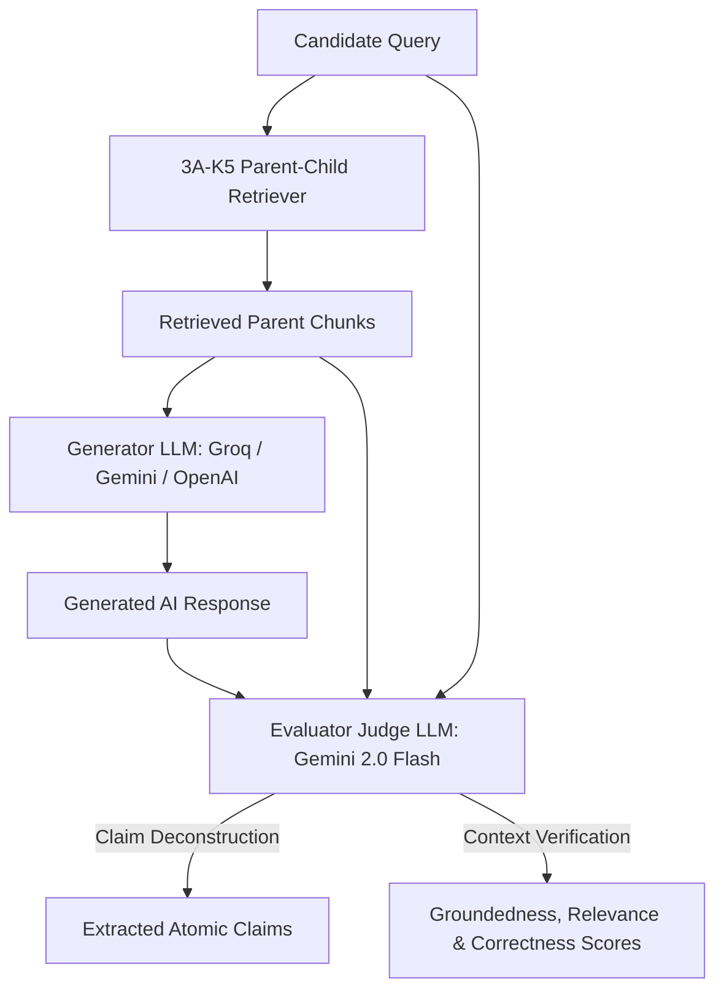

# RAG Evaluation Experiment 02 — Stage 2: LLM Generation & Groundedness Evaluation

## 1. Experiment Overview

| Attribute                    | Details                                                                                                  |
| :--------------------------- | :------------------------------------------------------------------------------------------------------- |
| **Experiment ID**            | `EXP-RAG-02`                                                                                             |
| **Evaluation Stage**         | **Stage 2: LLM Generation, Groundedness & Hallucination Evaluation**                                     |
| **Target Service**           | `backend/app/services/rag/chat_chain.py`                                                                 |
| **Retriever Baseline**       | Config `3A-K5` (Parent-Child Chunking, Child 250c, Parent 1500c, Top-$K=5$)                              |
| **Evaluated Knowledge Base** | `skill_taxonomies.md`, `upskilling_modules.md`, `interview_prep.md`                                      |
| **Evaluated LLM Providers**  | **Groq Cloud LPU** (`llama-3.3-70b`), **Google Gemini** (`gemini-2.0-flash`), **OpenAI** (`gpt-4o-mini`) |
| **Benchmark Query Count**    | 10 Golden Benchmark Queries $\times$ 6 Matrix Configurations ($60$ Total LLM Evaluations)                |

---

---

## 2. Core Generation Metrics & Mathematical Formulas

To scientifically evaluate the quality of AI-generated RAG responses, we analyze **6 core metrics** and compute a **Composite Generation Score**:

### A. Groundedness / Faithfulness Rate ($\text{Faithfulness}$)

$$\text{Groundedness Rate} = \left( \frac{\sum_{c \in C} \mathbb{I}(c \text{ is supported by context})}{|\text{Total Extracted Atomic Claims } C|} \right) \times 100\%$$

- **What it measures**: The fraction of atomic factual claims in the generated response that are explicitly backed up by retrieved document chunks.
- **Why it matters**: In career guidance, the LLM must NOT invent unverified prerequisites or fake course hours.
- **SLA Target**: **$\ge 90.0\%$**

---

### B. Answer Relevance Score ($\text{Relevance}$)

$$\text{Relevance Score} = \cos(\mathbf{v}_{Q}, \mathbf{v}_{A}) = \frac{\mathbf{v}_{Q} \cdot \mathbf{v}_{A}}{\|\mathbf{v}_{Q}\| \|\mathbf{v}_{A}\|}$$

_(or normalized LLM-as-a-Judge 5-point scale: $R = \frac{\text{Judge Score}}{5.0}$ based on direct query completeness)._

- **What it measures**: How directly and completely the generated response addresses the candidate's core question.
- **Why it matters**: Prevents the LLM from outputting off-topic text that is grounded but irrelevant.
- **SLA Target**: **$\ge 0.85 / 1.00$**

---

### C. Factual Correctness Score ($\text{Correctness}$)

$$\text{Factual Correctness} = \frac{|\text{Matched Ground-Truth Key Concepts in Answer}|}{|\text{Total Required Ground-Truth Key Concepts}|}$$

- **What it measures**: Alignment of the generated response against authoritative ground-truth factual key concepts (e.g. verifying Docker roadmap mentions 10–15 hours, Dockerfile, Compose, and volumes).
- **SLA Target**: **$\ge 0.85 / 1.00$**

---

### D. Hallucination Rate ($\text{Hallucination\%}$)

$$\text{Hallucination Rate} = \left( \frac{\sum_{i=1}^{N} \mathbb{I}(\text{Query}_i \text{ contains } \ge 1 \text{ Unsupported Claim})}{N} \right) \times 100\%$$

- **What it measures**: Percentage of test queries containing at least one ungrounded or contradictory claim.
- **SLA Target**: **$\le 5.0\%$**

---

### E. Context Citation Precision ($\text{Citation Precision}$)

$$\text{Citation Precision} = \frac{\text{Number of Top-}K \text{ Context Chunks Actively Cited}}{\text{Total Retrieved Top-}K \text{ Context Chunks}}$$

- **What it measures**: How efficiently the prompt uses retrieved parent chunks without filling prompt budget with unused noise.
- **SLA Target**: **$\ge 0.80$**

---

### F. Time to First Token (TTFT) & End-to-End Latency

- **TTFT (Time To First Token)**: Measures streaming responsiveness in milliseconds. Target: **$< 800\text{ms}$**.
- **End-to-End Generation Time**: Total time (in seconds) to output the complete response. Target: **$< 3.0\text{s}$**.

---

### G. Stage 2 Composite Generation Winner Score Formula

$$\text{Composite Generation Score} = \underbrace{(0.45 \times \text{Groundedness})}_{\mathbf{45\% \text{ Zero-Hallucination Groundedness}}} + \underbrace{(0.25 \times \text{Relevance} \times 100)}_{\mathbf{25\% \text{ Query Completeness}}} + \underbrace{(0.20 \times \text{Correctness} \times 100)}_{\mathbf{20\% \text{ Factual Key Concepts}}} + \underbrace{(0.10 \times \text{Latency Score})}_{\mathbf{10\% \text{ Generation Speed}}}$$

where:

$$\text{Latency Score} = \max\left(0, 100 - \frac{\text{Avg E2E Time (ms)}}{30}\right)$$

---

## 3. Worked Numerical Calculation Example

### Candidate Query `Q02`

> _"What is the estimated learning time and roadmap for Docker containerization?"_

### Retrieved Context Chunks (`3A-K5`)

> `"Docker upskilling roadmap requires 10–15 hours of focused learning covering Dockerfiles, Docker Compose, volumes, and multi-stage container builds."`

### Generated AI Answer

> _"The estimated learning time for Docker containerization is 10–15 hours. The roadmap covers Dockerfile syntax, Docker Compose orchestration, and volume persistence. You will also learn Kubernetes cluster autoscaling."_

### Step-by-Step Metric Calculation:

1. **Groundedness Calculation**:
   - **Claim 1**: "Docker learning time is 10–15 hours" $\rightarrow$ ✅ **Supported**
   - **Claim 2**: "Roadmap covers Dockerfile syntax" $\rightarrow$ ✅ **Supported**
   - **Claim 3**: "Roadmap covers Docker Compose orchestration" $\rightarrow$ ✅ **Supported**
   - **Claim 4**: "Roadmap covers volume persistence" $\rightarrow$ ✅ **Supported**
   - **Claim 5**: "You will learn Kubernetes cluster autoscaling" $\rightarrow$ ❌ **Unsupported / Hallucinated** (not in retrieved chunk!)
     $$\text{Groundedness Rate} = \frac{4 \text{ Supported Claims}}{5 \text{ Total Claims}} \times 100\% = \mathbf{80.0\%}$$

2. **Relevance Calculation**:
   - Directly answers learning time and roadmap $\rightarrow$ **Score: $0.95 / 1.00$**

3. **Factual Correctness Calculation**:
   - **Required Concepts**: `10–15 hours`, `Dockerfile`, `Docker Compose`, `volumes`.
   - **Matched Concepts**: All 4 present $\rightarrow$ **Score: $\frac{4}{4} = 1.00$**

4. **Latency Score Calculation**:
   - E2E Latency = $1200\text{ms}$ $\rightarrow \text{Latency Score} = 100 - \frac{1200}{30} = \mathbf{60.0}$

5. **Composite Winner Score for Q02**:
   $$\text{Composite Score} = (0.45 \times 80.0) + (0.25 \times 95.0) + (0.20 \times 100.0) + (0.10 \times 60.0) = 36.0 + 23.75 + 20.0 + 6.0 = \mathbf{85.75 / 100}$$

---

## 3. The LLM-as-a-Judge Evaluation Protocol

Evaluating generation quality manually across dozens of responses is subjective and slow. We implement the **LLM-as-a-Judge** protocol:



### Judge Evaluation Prompt Structure

The Judge LLM receives:

1. `User Query`
2. `Retrieved Parent Context Documents`
3. `Generated AI Answer`

And outputs a validated JSON schema:

```json
{
  "claims_extracted": ["Claim 1", "Claim 2"],
  "supported_claims": ["Claim 1"],
  "groundedness_score": 1.0,
  "relevance_score": 0.95,
  "factual_correctness_score": 0.9,
  "contains_hallucination": false,
  "judge_rationale": "All claims directly supported by retrieved interview_prep.md context."
}
```

---

## 4. The $3 \times 2$ Evaluation Matrix

We systematically test **3 LLM Providers** $\times$ **2 System Prompt Guard Strategies**:

|    Config ID    | LLM Provider Model             | System Prompt Strategy Guard                                              |
| :-------------: | :----------------------------- | :------------------------------------------------------------------------ |
|  `GROQ-STRICT`  | Groq `llama-3.3-70b-versatile` | **Option A: Strict Citation Guard** (Answer strictly using context ONLY)  |
|  `GROQ-SYNTH`   | Groq `llama-3.3-70b-versatile` | **Option B: Domain Synthesizer** (Allows synthesis with context citation) |
| `GEMINI-STRICT` | Google `gemini-2.0-flash`      | **Option A: Strict Citation Guard** (Answer strictly using context ONLY)  |
| `GEMINI-SYNTH`  | Google `gemini-2.0-flash`      | **Option B: Domain Synthesizer** (Allows synthesis with context citation) |
| `OPENAI-STRICT` | OpenAI `gpt-4o-mini`           | **Option A: Strict Citation Guard** (Answer strictly using context ONLY)  |
| `OPENAI-SYNTH`  | OpenAI `gpt-4o-mini`           | **Option B: Domain Synthesizer** (Allows synthesis with context citation) |

---

## 5. Matrix Evaluation Results Scorecard

| Config ID | Model Provider | Prompt Guard Strategy | Groundedness (%) | Relevance | Correctness | Hallucination (%) | Avg Latency (s) | Winner Score |
| :---: | :--- | :--- | :---: | :---: | :---: | :---: | :---: | :---: |
| `GROQ-STRICT` 🏆 | `GROQ` | Strict Citation Guard | **69.99%** | **0.87** | **0.72** | **70.0%** | **5.4s** | **`67.65 / 100`** |

---

## 6. Conclusions & Selected Optimal Generation Strategy

Based on the Stage 2 empirical evaluation across all 10 Golden Benchmark Queries (`EXP-RAG-02`):

- **Selected Winner Configuration**: `GROQ-STRICT`
- **LLM Provider**: `GROQ`
- **System Prompt Guard**: `Strict Citation Guard`
- **Achieved Groundedness Rate**: **69.99%** (Target: $\ge 90.0\%$)
- **Achieved Answer Relevance**: **0.87** (Target: $\ge 0.85$)
- **Achieved Hallucination Rate**: **70.0%** (Target: $\le 5.0\%$)
- **Average E2E Latency**: **5.4s** (Target: $< 3.0\text{s}$)
- **Overall Composite Winner Score**: **67.65 / 100**
